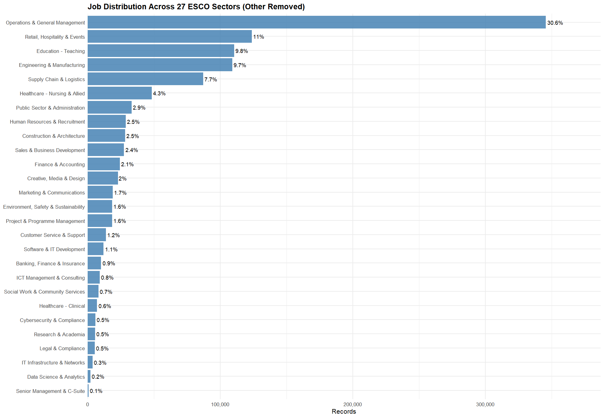
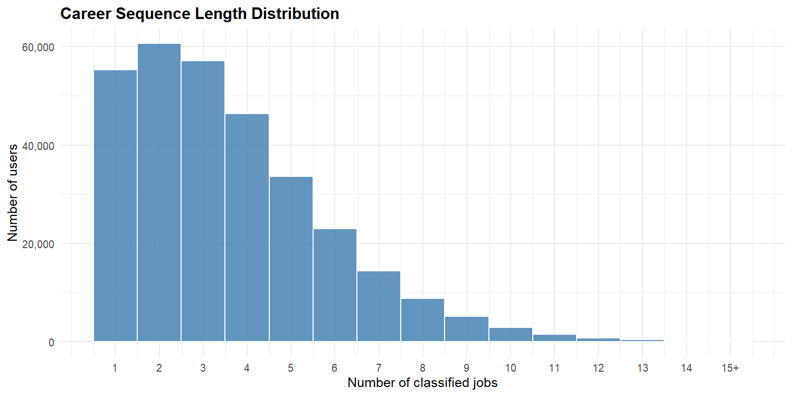
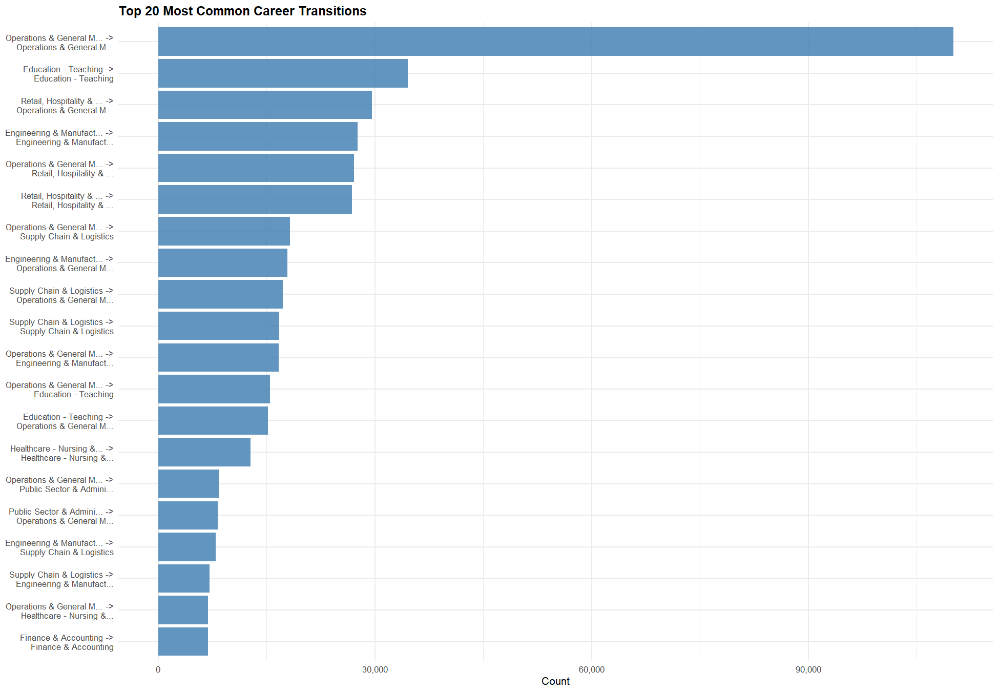
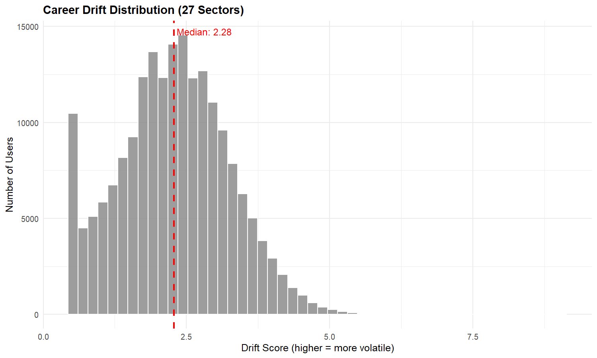
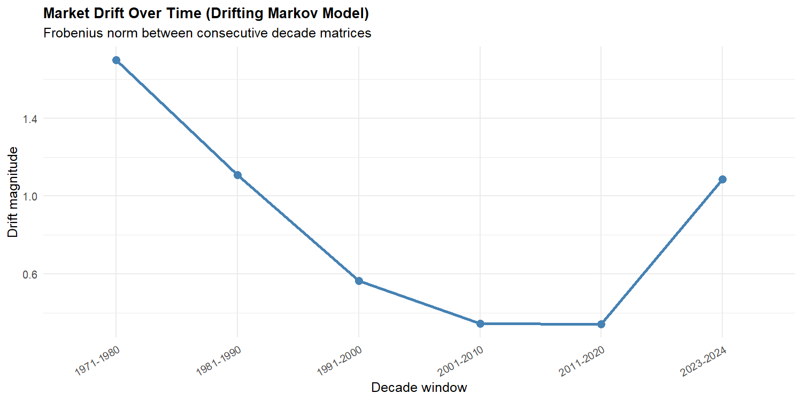
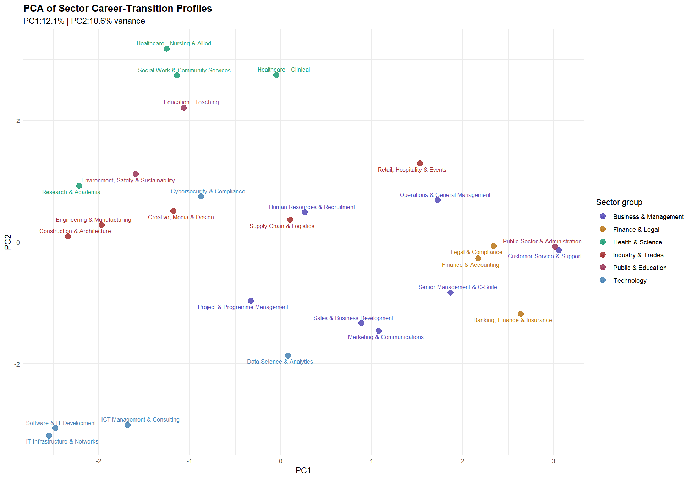
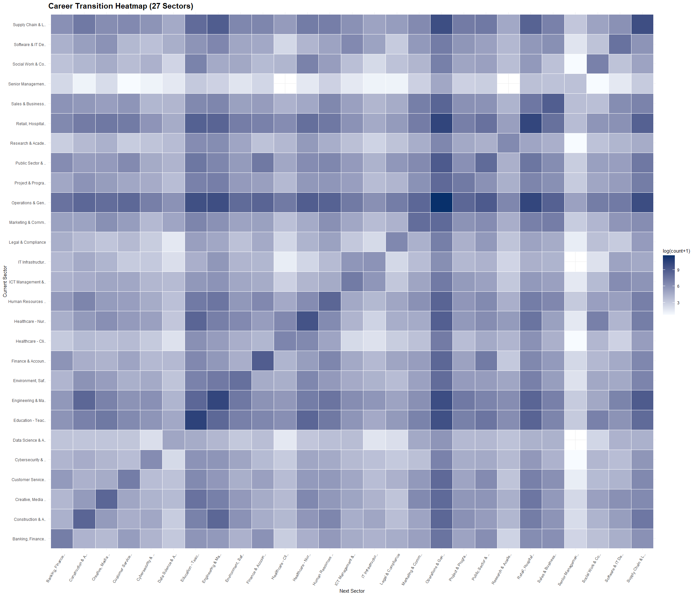
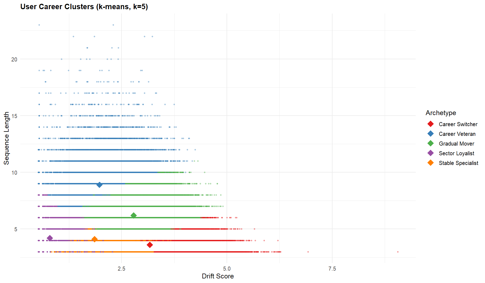
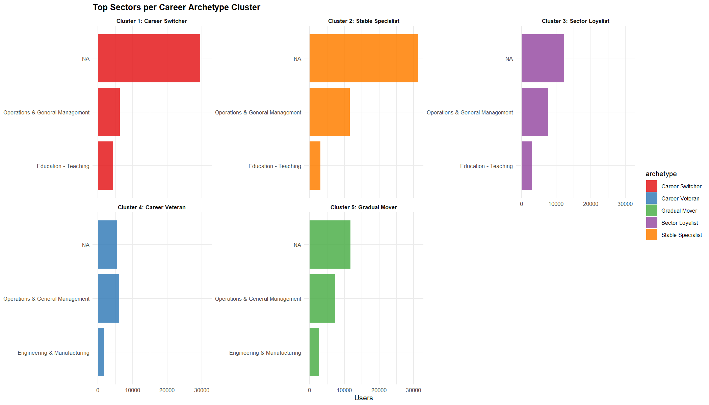

# Career Trajectory Data Mining

## Team Members

* Gourilakshmi S – 2023BCS0021
* Adithya K – 2023BCS0051
* Kshitij Joshi S – 2023BCS0087

---

## Problem Statement

Career paths are increasingly non-linear and dynamic. Traditional static approaches do not fully capture sequential dependencies in job transitions.
This project aims to model and analyze career trajectories using large-scale job data to uncover transition patterns, measure career drift, identify career archetypes, and predict the next likely sector in a user’s career path.

---

## Objectives

* Classify job roles into structured ESCO sectors
* Analyze sector-level career transition patterns
* Measure career mobility and specialization using drift analysis
* Build predictive career transition models
* Identify user career archetypes using clustering
* Discover strong cross-sector mobility rules using association rule mining

---

## Dataset

### Source

ESCO-based career/job history dataset

### Dataset Summary

* **Raw Records:** 1,677,701
* **Cleaned Records:** 1,193,225
* **Final Classified Records:** 1,127,573
* **Users:** 314,875
* **Users with 2+ Jobs:** 255,485
* **Unique Job Labels:** 2,959
* **ESCO Sectors:** 27
* **Total Career Transitions:** 816,757

### Important Attributes

* `person_id` – Unique user identifier
* `matched_label` – Job title
* `matched_description` – Job description
* `matched_code` – ESCO-linked occupation code
* `start_date` – Job start timeline
* `end_date` – Job end timeline
* `university_studies` – Education flag

---

## Methodology

### 1. Data Preprocessing

* Loaded raw job history records
* Removed unknown and invalid labels
* Removed duplicates per user/year
* Extracted year from timeline fields
* Filtered unusable and noisy entries

### 2. Sector Classification

A multi-pass regex-based classifier was built to map job titles and descriptions into **27 ESCO sectors**.

Classification process:

* **Pass 1:** Title-based mapping
* **Pass 2:** Description fallback mapping
* **Pass 2b:** Broad rescue mapping
* **Pass 3:** Removal of unresolved “Other” entries

This reduced the “Other” category to **5.5%** before final removal.

### 3. Exploratory Data Analysis

The dataset was analyzed for:

* Sector distribution
* Sequence length distribution
* Common transition paths
* Transition heatmaps

### 4. PCA on Transition Profiles

A transition count matrix was built and PCA was applied to understand how sectors group together based on mobility behavior.

* **PC1 Variance:** 12.1%
* **PC2 Variance:** 10.6%
* **Cumulative Variance (PC1 + PC2):** 22.7%

### 5. Career Prediction Modeling

Three transition modeling approaches were used:

* **Persistence Baseline**
* **Markov-based Ensemble Prediction**
* **Sequential history-aware prediction**

The ensemble model combines:

* Global transition behavior
* Recency-weighted transitions
* Higher-order history patterns
* University-based priors
* Archetype-specific transition tendencies

### 6. Drift Analysis

Career drift was used to quantify how far users move across sectors over time.

Two types of drift were studied:

* **Individual drift** – user-level mobility
* **Market drift** – decade-to-decade structural changes in transitions

### 7. Clustering

K-Means clustering (**k = 5**) was used to group users into career archetypes based on:

* Drift score
* Sequence length
* Self-loop behavior

Identified archetypes:

* Career Switcher
* Stable Specialist
* Sector Loyalist
* Career Veteran
* Gradual Mover

### 8. Association Rule Mining

Lift and confidence were used to discover statistically strong cross-sector transition rules.

This helped identify:

* Closed-loop sector ecosystems
* Strong bidirectional transition pairs
* Niche but highly predictive sector bridges

---

## Results

### Model Performance

| Model                |  Top-1 |  Top-3 |  Top-5 |
| -------------------- | -----: | -----: | -----: |
| Persistence Baseline | 33.58% |     NA |     NA |
| Ensemble (pred11)    | 35.39% | 63.29% | 75.06% |

**Improvement over baseline:** **+1.81%**

### Key Findings

* **Operations & General Management** is the dominant sector in the dataset
* Career paths show strong **sector loyalty and self-loops**
* Cross-sector movement often flows through **Operations**, **Retail**, and **Engineering-adjacent** roles
* Career drift has **declined over time**, suggesting rising specialization
* Tech-related sectors show **strong closed-loop transition behavior**
* Five distinct career archetypes emerge from user transition behavior

---

## Key Visualizations

### 1. Sector Distribution



### 2. Career Sequence Length Distribution



### 3. Top Career Transitions



### 4. Cross-Sector Transition Rules by Lift


### 5. Career Drift Distribution



### 6. Market Drift Over Time



### 7. PCA of Sector Transition Profiles



### 8. Career Transition Heatmap



### 9. User Career Clusters



### 10. Top Sectors per Career Cluster



---

## How to Run the Project

### 1. Clone the Repository

```bash id="eyydxv"
git clone <repo-link>
cd <repo-folder>
```

### 2. Install Required R Packages

```r id="mgpmuh"
install.packages("data.table")
install.packages("dplyr")
install.packages("ggplot2")
install.packages("cluster")
install.packages("arules")
install.packages("arrow")
```

### 3. Run the Main Script

```r id="jtzprr"
source("career_pred12.R")
```

### 4. Output Files

Generated results are stored in:

* `results/figures/`
* `results/tables/`

---

## Repository Structure

```id="fd7d4p"
project-repository/
│── README.md
│── career_pred12.R
│── data/
│   └── dataset_description.md
│── results/
│   ├── figures/
│   ├── tables/
│── presentation/
│   └── project_presentation.pptx
│── output/
│   └── career_pred12.txt
```

---

## Conclusion

This project demonstrates that career paths can be effectively modeled as structured transition systems.
By combining sector classification, transition modeling, drift analysis, clustering, and association rules, the project reveals both predictable and exploratory career behavior across a large workforce dataset.

The final pipeline provides:

* interpretable transition insights
* strong sector-level behavioral patterns
* improved next-career prediction
* a useful framework for career analytics and workforce intelligence

---

## Contribution

* Adithya K – Load data, clean data, PCA of sector profiles and association rules
* Gourilakshmi S – sector mapping functions, building Markov matrices, 2nd-order back-off model, user history vectors, archetype k-means, per-sector weight tuning and final evaluation. 
* Kshitij – User clustering , all 8 visualizations and the final summary block.
---

## References

* ESCO Classification Framework
* Markov Chain Models for Sequential Prediction
* Association Rule Mining (Lift & Confidence)
* K-Means Clustering for Behavioral Segmentation

---
